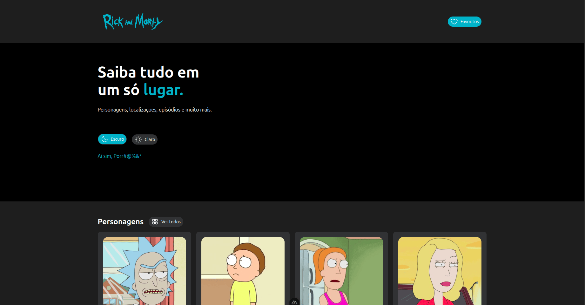

## Apresentação Geral

**Nome do Projeto:** Rick and Morty 

**Descrição:**

Este projeto é uma aplicação desenvolvida com Vue, Nuxt e Tailwind que consome a API do Rick and Morty. O objetivo é estudar e aplicar na prática os recursos do Nuxt, criando uma interface organizada e responsiva. A aplicação permite navegar pelos dados, visualizar informações detalhadas e favoritar itens. Todo o projeto segue boas práticas de estrutura, componentes, rotas e consumo de API recomendadas pela documentação do Nuxt.



**Objetivo:**

Desenvolver em Nuxt 4.0 uma aplicação seguindo boas práticas modernas, consumindo a [API do Rick and Morty](https://rickandmortyapi.com/) e adotando como base o layout disponível no [Figma Comunitário](https://www.figma.com/design/Z3Edh8V2ya3evVcMVibXej/Rick-and-Morty--Community-?node-id=0-1&p=f).

**Tecnologias Utilizadas:**


## Para Desenvolvedores

Se você é um desenvolvedor interessado em contribuir ou entender melhor o funcionamento do projeto, aqui estão algumas informações adicionais:

**Ambiente:**


**Instruções de Instalação e Configuração:**

1. Clone o repositório do projeto:
```
git clone https://github.com/edssaac/rick-and-morty
```

2. Navegue até o diretório do projeto:
```
cd rick-and-morty
```

3. Instale as dependências:
```
npm install
```

4. Inicie a aplicação:
```
npm run dev
```

5. Acesse a aplicação pelo navegador:
```
http://localhost:3000/
```

## Contato

[](https://github.com/edssaac)
[](mailto:edssaac@gmail.com)
[](mailto:edssaac@outlook.com)
[](https://www.linkedin.com/in/edssaac)
